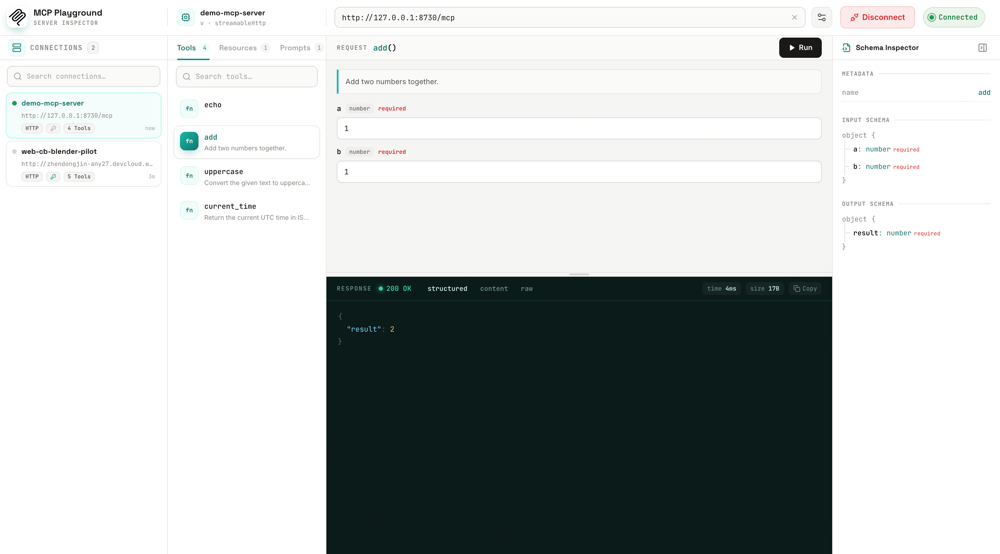

# MCP Playground

A Postman-like **MCP Server debugging tool**. Fill in a remote MCP Server URL with custom headers to establish a connection, browse its exposed **Tools / Resources / Prompts**, invoke any Tool with parameters, and inspect the results.

The backend uses the official `@modelcontextprotocol/sdk` as a client proxy to bypass browser CORS, and supports **Streamable HTTP / SSE auto-detection**.



## Tech Stack

- **Frontend** `packages/web`: React + Vite + TypeScript + Tailwind CSS + TanStack Query + Zustand
- **Backend** `packages/server`: Node + Express + TypeScript + `@modelcontextprotocol/sdk` + pino
- **Shared types** `packages/shared`
- Monorepo: pnpm workspace

## Project Structure

```
packages/
├── shared/   Shared types between frontend and backend
├── server/   Express proxy layer (session pool + MCP client wrapper)
└── web/      React three-column workbench UI (V4 design)
```

## Quick Start

```bash
pnpm install

# Start frontend and backend together (server:8787 / web:5173, web proxies /api → server)
pnpm dev

# Or start them separately
pnpm dev:server
pnpm dev:web
```

Open http://localhost:5173

## UI (V4 Design)

- **Top connection bar**: `MCP` address bar + transport type (Auto / Streamable HTTP / SSE) + header editor (expand via gear icon) + connect/disconnect + status light
- **Left capability list**: collapsible Tools / Resources / Prompts groups + search
- **Center request/response split view**: top REQUEST (input form auto-generated from JSON Schema + run), bottom RESPONSE (dark result area, structured/content/raw toggle, latency/size, copy)
- **Right Schema Inspector**: metadata + Input/Output Schema tree

Color scheme: teal + stone (warm gray); fonts: Sora / IBM Plex Sans / IBM Plex Mono.

## Backend API

| Method | Path | Description |
|---|---|---|
| POST | `/api/mcp/connect` | Establish connection, returns `sessionId` + `serverInfo` |
| POST | `/api/mcp/disconnect` | Disconnect and clean up the session |
| GET | `/api/mcp/capabilities` | Fetch tools/resources/prompts in one call |
| POST | `/api/mcp/call` | Invoke a Tool |
| POST | `/api/mcp/read` | Read a Resource |
| POST | `/api/mcp/prompt` | Get a rendered Prompt result |
| GET | `/api/health` | Health check |

## Design Highlights

- **Session pool**: the backend reuses `Client` instances by `sessionId` to avoid repeated handshakes; idle sessions are cleaned up automatically on timeout.
- **Transport auto-detection**: in `auto` mode, it first tries Streamable HTTP, and falls back to SSE with a fresh Client on failure.
- **Security**: only http/https target addresses are allowed; headers/tokens are redacted in logs.
- **Persistence**: connection config (URL / transport / headers) is saved in browser localStorage.

## Environment Variables

- `PORT`: backend port (default 8787)
- `SESSION_IDLE_TIMEOUT_MS`: session idle timeout (default 30 minutes)
- `VITE_API_TARGET`: frontend proxy target (default http://localhost:8787)
